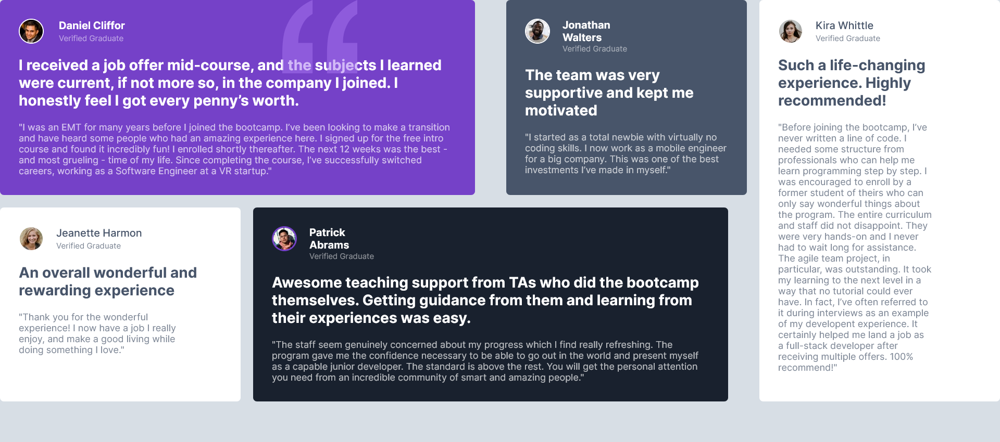

# Frontend Mentor - Testimonials grid section solution

This is a solution to the [Testimonials grid section challenge on Frontend Mentor](https://www.frontendmentor.io/challenges/testimonials-grid-section-Nnw6J7Un7). Frontend Mentor challenges help you improve your coding skills by building realistic projects. 

## Table of contents

- [Overview](#overview)
  - [The challenge](#the-challenge)
  - [Screenshot](#screenshot)
  - [Links](#links)
  - [Built with](#built-with)
  - [What I learned](#what-i-learned)
  - [Continued development](#continued-development)
- [Author](#author)
- [Acknowledgments](#acknowledgments)

### The challenge

Users should be able to:

- View the optimal layout for the site depending on their device's screen size

### Screenshot

### Links

- Solution URL: [also here](https://testimonials-grid-section-dun-iota.vercel.app/)
- Live Site URL: [over here](https://testimonials-grid-section-dun-iota.vercel.app/)

### Built with

- Semantic HTML5 markup
- Flexbox
- CSS Grid
- [React](https://reactjs.org/) - JS library

### What I learned

This is the first time i used grid in a project and i know there are a lot of things i could improve on.

### Continued development

I plan on continuing honing my css skills especially flexbox and gird
## Author

- Frontend Mentor - [@mmustaphak](https://www.frontendmentor.io/profile/mmustaphak)
- Twitter - [@mmustaphak1](https://www.twitter.com/mmustaphak1)

## Acknowledgments

 i would like to use this opportunity to appreciate a friend and mentor Esin Ridollah. This link his soical will be in the link below.

 -Twitter - [@esinnation](https://twitter.com/esinnation)
